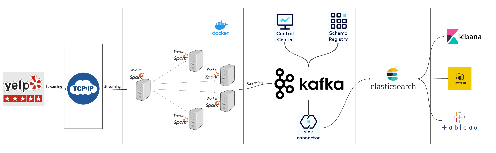
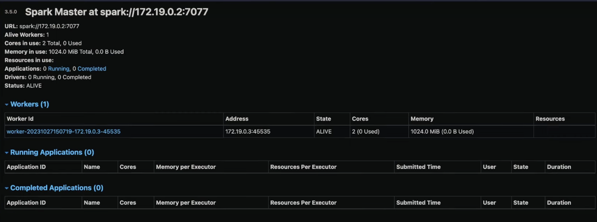
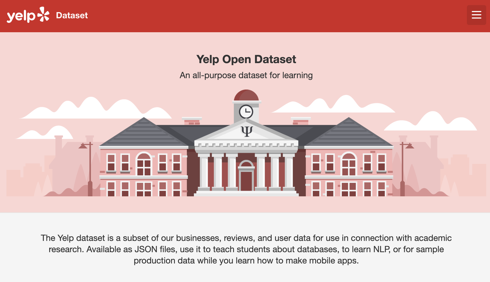
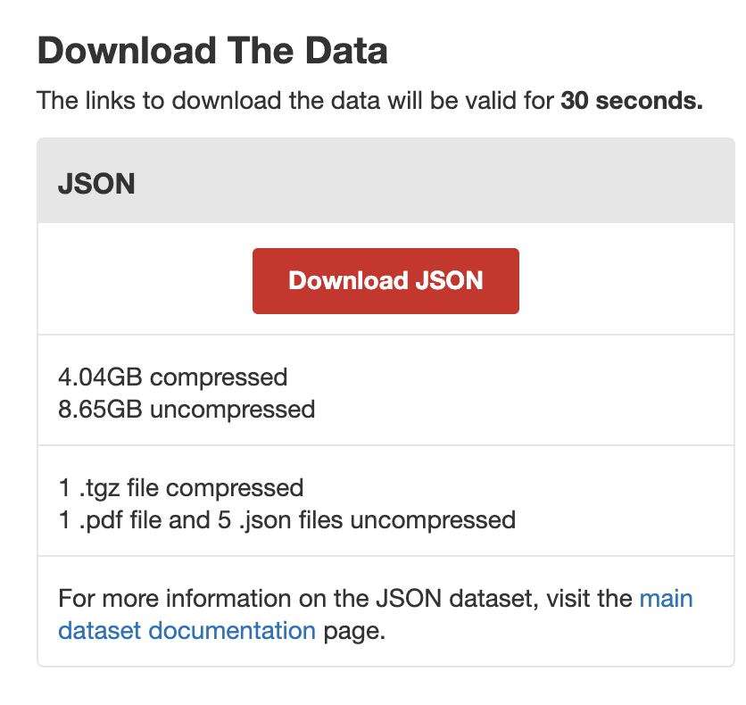
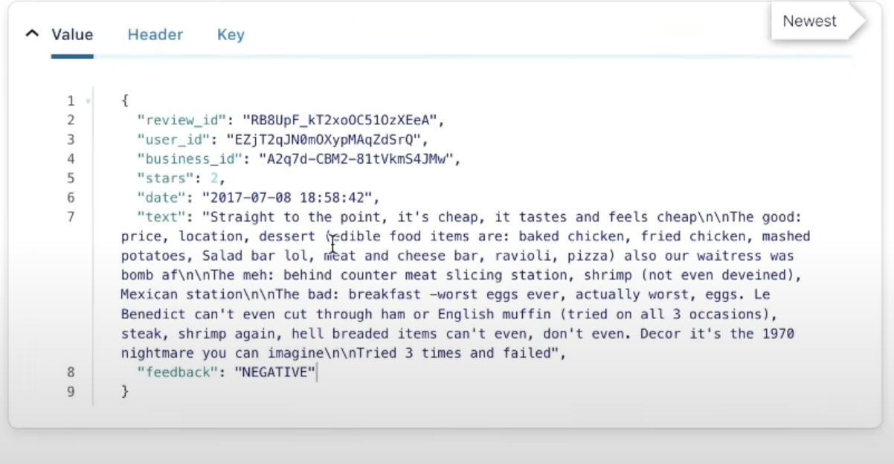
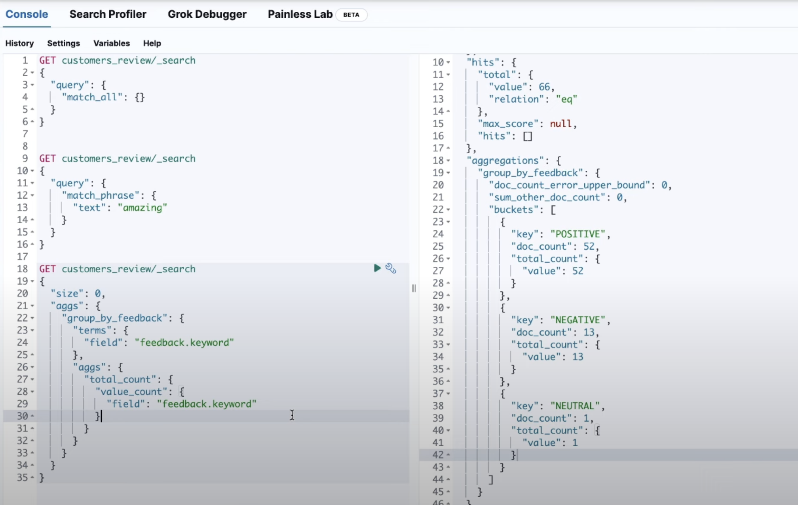

# Yelp Realtime Data Streaming With TCP Socket, Apache Spark, OpenAI LLM, Kafka and Elasticsearch | End-to-End Data Engineering Project


Credits: [Yelp](https://blog.yelp.com/news/yelp-consumer-product-updates-april-2023/)

## Introduction

This project serves as a comprehensive guide to building an end-to-end data engineering pipeline using TCP/IP Socket, Apache Spark, OpenAI LLM, Kafka and Elasticsearch. It covers each stage from data acquisition, processing, sentiment analysis with LLMs, production to kafka topic and connection to elasticsearch.

## System Architecture



The project is designed with the following components:

- **Data Source**: We use `yelp.com` dataset for our pipeline.
- **TCP/IP Socket**: Used to stream data over the network in chunks
- **Apache Spark**: For data processing with its master and worker nodes.
- **Confluent Kafka**: Our cluster on the cloud
- **Control Center and Schema Registry**: Helps in monitoring and schema management of our Kafka streams.
- **Kafka Connect**: For connecting to elasticsearch
- **Elasticsearch**: For indexing and querying

## Skills Gained

- Setting up data pipeline with TCP/IP 
- Real-time data streaming with Apache Kafka
- Data processing techniques with Apache Spark
- Realtime sentiment analysis with OpenAI ChatGPT
- Synchronising data from kafka to elasticsearch
- Indexing and Querying data on elasticsearch

## Technologies

- Python
- TCP/IP
- Confluent Kafka
- Apache Spark
- Docker
- Elasticsearch
- LLAMA via Groq


## Steps

### 1) Docker and docker compose:
- Set up DockerFile and docker-compose

### 2) Initialize Spark

Why Spark? We initialize Apache Spark, as it is a big data processing engine that allows us to process large datasets in parallel.


- After containerization, we can see a port next to it


- We open it to check if it runs



### 3) Fetch Dataset
- Data got from Yelp Open data portal, we have fetched their data which is around 8 GB uncompressed and we utilize the reviews dataset which is around 5 GB




https://www.yelp.com/dataset

- Since it is such a large dataset, we will try to do streaming to simulate real-world scenarios and gain an understanding as well

### 4) Set up the TCP IP Socket Source

- We then build a TCP/IP socket, which is a communication endpoint that allows you to send data from one point (our dataset location) to another point (in this case, a Spark application). This is done to simulate a real-time data stream, where data is being generated continuously and needs to be processed in real-time.
Think of it like a pipeline: you have a source of data (our dataset location), and you want to send that data to a processing engine (Spark) for analysis. The TCP/IP socket is like a pipe that connects the two, allowing data to flow from the source to the processing engine.

- Done in file "streaming-socket.py" inside jobs
### 5) Set up the Spark Streaming

Spark the fetches the data from the TCP/IP socket and processes it in real-time. This is where the magic happens, and Spark performs its data processing and analysis tasks.

- Done in file "streaming-socket.py" inside jobs

### 6) Set up Kafka 

- We go ahead to the Kafka Confluent Cloud website and create our Kafka environment and get our API keys as well.

**What is Kafka ?** Kafka is a distributed streaming platform that allows you to publish and subscribe to data streams. In our project, Kafka is used to handle the data streams generated by Spark. Think of Kafka like a message bus that allows different applications to communicate with each other.

**What is Kafka Cluster?:** A Kafka cluster is a group of Kafka brokers that work together to provide a fault-tolerant and scalable messaging system. In our project, the Kafka cluster is used to handle the data streams generated by Spark. The cluster consists of multiple brokers, each of which can handle a portion of the data stream.

Use of Kafka: Kafka is used in our project to:

   - Handle the data streams generated by Spark
   - Provide a fault-tolerant and scalable messaging system 
   - Allow different applications to communicate with each other

**What is Confluent Cloud?**: Confluent Cloud is a fully managed, cloud-native service that allows you to deploy and manage Apache Kafka clusters in the cloud. It provides a scalable, secure, and reliable way to build and manage Kafka clusters, without the need for manual configuration and management.

Confluent Cloud is built on top of Apache Kafka and provides a range of features and tools to make it easier to use Kafka in the cloud. Some of the key features of Confluent Cloud include:

   - Fully managed Kafka clusters: Confluent Cloud provides fully managed Kafka clusters, which means that you don't need to worry about configuring and managing the clusters ourself.
   - Scalability: Confluent Cloud allows you to scale our Kafka clusters up or down as needed, without the need for manual configuration.
   - Security: Confluent Cloud provides a range of security features, including encryption, authentication, and authorization, to ensure that our Kafka clusters are secure.
   - Reliability: Confluent Cloud provides a range of features to ensure that our Kafka clusters are reliable, including automatic failover and disaster recovery.
   - Integration with other cloud services: Confluent Cloud provides integration with other cloud services, such as AWS, GCP, and Azure, making it easy to use Kafka with other cloud-based services.

- Included in the file "streaming-socket.py" inside jobs

### 7) Set Up and Test LLM for Sentiment Analysis

- We then create an Open Ai key, can use any LLM api keys
- We also set up a prompt like so for it to analyse
```python
{
  "role": "system",
  "content": """
      You're a machine learning model with a task of classifying comments into POSITIVE, NEGATIVE, NEUTRAL.
      You are to respond with one word from the option specified above, do not add anything else.
      Here is the comment:
      
      {comment}
  """.format(comment=comment)
}

```
- We then use the LLM to generate sentiment on the review and append the result to the reviews data to then be sent to kafka
- This is also included in the file "streaming-socket.py" inside jobs
- We should get something like this in our Kafka cloud, once we set it up and run the code


### 8) Set Up and Use Elasticsearch Service
**Why Elasticsearch?:** Elasticsearch is used to enable real-time data streaming and analytics. Confluent Cloud provides a managed Elasticsearch service that allows you to stream data from Kafka directly into Elasticsearch, where it can be used for log analysis, security analytics, or full-text search.

**Elasticsearch Sink API Key**: The Elasticsearch Sink API key is used to connect our Confluent Cloud cluster to our Elasticsearch website. This key allows you to stream data from Kafka to Elasticsearch, where it can be indexed and searched.

**Indexing:** Once you've connected our Confluent Cloud cluster to our Elasticsearch website using the Elasticsearch Sink API key, the data will be indexed in Elasticsearch. This means that the data will be stored in a searchable format, allowing you to query and analyze it using Elasticsearch's powerful search capabilities.

This image is showing the indexing process in action at the Elasticsearch website
. 


**Connecting to Power BI:** Next further steps could be to connect to Power BI, for that we'll need to use the Elasticsearch API to retrieve the data and then connect it to Power BI using the Power BI API.

Here's an example of how you might connect to Power BI using Python:

```python

import requests
import pandas as pd

# Retrieve data from Elasticsearch
es_url = "https://your-es-url.com"
es_index = "your-index-name"
es_query = {
    "query": {
        "match_all": {}
    }
}
response = requests.get(es_url + "/" + es_index + "/_search", json=es_query)
data = response.json()

# Transform data
df = pd.DataFrame(data["hits"]["hits"])

# Connect to Power BI
power_bi_url = "https://your-power-bi-url.com"
power_bi_api_key = "your-power-bi-api-key"
power_bi_dataset_id = "your-power-bi-dataset-id"
power_bi_table_name = "your-power-bi-table-name"

# Upload data to Power BI
response = requests.post(power_bi_url + "/datasets/" + power_bi_dataset_id + "/tables/" + power_bi_table_name, json=df.to_dict())

```

### Other use cases
The knowledge and skills gained from this project can be applied to other use cases, such as:
- Customer segmentation: The sentiment analysis model can be used to segment customers based on their sentiment towards a product or service.
- Product recommendation: The Elasticsearch index can be used to recommend products to customers based on their search history and sentiment.
- Fraud detection: The Kafka cluster can be used to stream data from applications to a data warehouse, where it can be used to detect fraudulent activity.
- Real-time analytics: The Apache Spark application can be used to process data in real-time, providing insights into customer behavior and sentiment.

## Conclusion
In conclusion, this project demonstrates a comprehensive data engineering pipeline for real-time sentiment analysis of Yelp reviews using a combination of cutting-edge technologies. By leveraging Docker for containerization, Spark for data processing, Kafka for messaging, and Elasticsearch for indexing, this pipeline is capable of handling large volumes of data and providing valuable insights into customer sentiment. The integration of a large language model (LLM) for sentiment analysis enables accurate and efficient processing of text data, while the use of Elasticsearch facilitates fast and flexible querying of the analyzed data. Overall, this project showcases a scalable and efficient architecture for real-time data processing and analysis, with applications in various industries such as customer service, marketing, and product development.